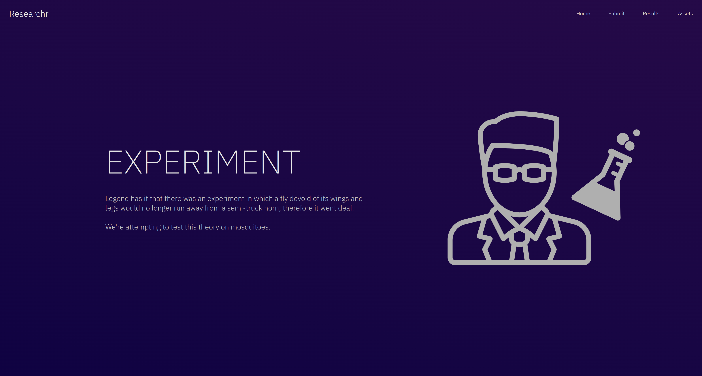
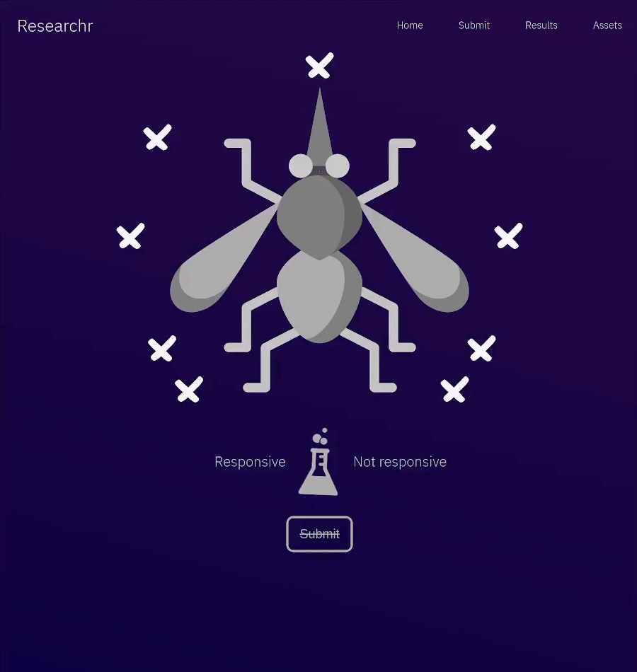

# Goals
Researchr is a simple learning golang project.\
Backend is focused on simplicity over throughput.\
Frontend will attempt to be visually pleasing with very restricted tools.

# Tech
Templates\
No JavaScript\
No Rasterized graphics\
More generalised SQL driver

# Preview

# How to run
Server will listen on port 9000.
## Podman
`make db-up` followed by `make run`.\
Use `make db-down` for teardown.

## Docker
`make docker-db-up` followed by `make run`.\
Use `make docker-db-down` for teardown.
